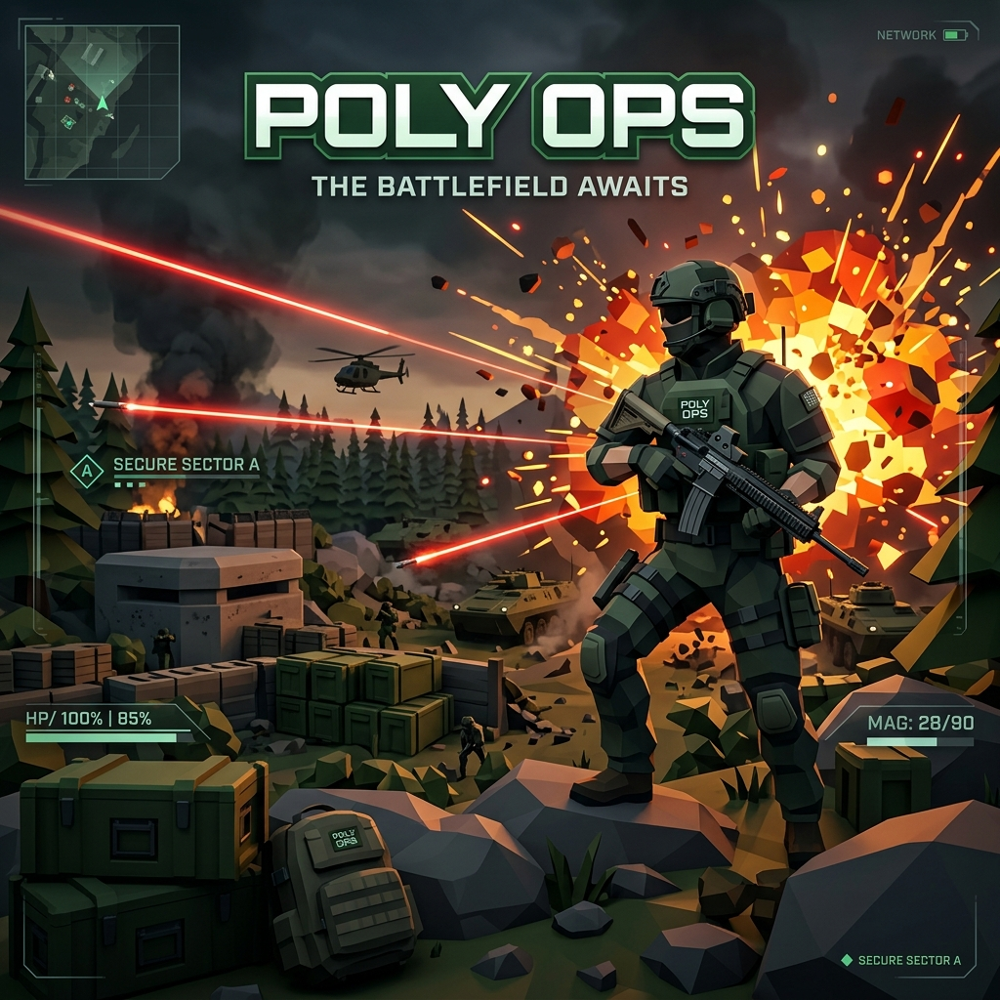

<!-- markdownlint-disable MD033 MD041 -->
<div align="center">

# Poly Ops - 3D Tactical Shooter

<p align="center">

</p>

*Browser-Based Low-Poly First-Person Shooter Proving Grounds*

[](https://developer.mozilla.org/en-US/docs/Web/HTML)
[](https://developer.mozilla.org/en-US/docs/Web/CSS)
[](https://react.dev)
[](https://www.typescriptlang.org)
[](https://threejs.org)
[](https://tailwindcss.com)
[](https://vite.dev)
[](https://vercel.com)

[](https://github.com/Blue-Rangoon/Poly-Ops-Tactical-Shooter/commits/main)
[](https://github.com/Blue-Rangoon/Poly-Ops-Tactical-Shooter/stargazers)
[](https://github.com/Blue-Rangoon/Poly-Ops-Tactical-Shooter/network/members)
[](LICENSE)
[](https://github.com/Blue-Rangoon/Poly-Ops-Tactical-Shooter)

</div>

---



---

## 📋 Table of Contents

- [About The Project](#about-the-project)
- [⭐ Repository Visitors](#-repository-visitors)
- [✨ Core Features](#-core-features)
  - [1. Swappable Weapon Arsenal](#1-swappable-weapon-arsenal)
  - [2. Dynamic Hostile AI Matrix](#2-dynamic-hostile-ai-matrix)
  - [3. Procedural Audio Synthesis](#3-procedural-audio-synthesis)
  - [4. High-Performance 3D Visuals](#4-high-performance-3d-visuals)
- [🛠️ Tech Stack](#-tech-stack)
- [🕹️ Command Controls](#-command-controls)
- [🚀 Getting Started](#-getting-started)
  - [Prerequisites](#prerequisites)
  - [Installation](#installation)
  - [Running the Application](#running-the-application)
  - [Building for Production](#building-for-production)
- [📂 Project Structure](#-project-structure)
- [⚖️ Legal & Content Disclaimer](#-legal--content-disclaimer)
- [🤝 Contributing](#-contributing)
- [📄 License](#-license)
- [👥 Operator Communications Hub](#-operator-communications-hub)
- [❤️ Made with Love](#-made-with-love)

---

## About The Project

**Poly Ops** is a browser-based, high-fidelity 3D tactical shooter simulation. Designed with a clean low-poly military aesthetic, the game challenges operators to defend a combat perimeter against progressive waves of smart hostile AI units. 

Featuring fully procedural Audio Synthesis (Web Audio API), physics-based player motion, and a tactile four-weapon gun catalog, **Poly Ops** runs natively inside modern desktop browsers without requiring heavy external asset downloads.

> 💡 **Live Demo:** [Poly Ops Live Battlefield](https://poly-ops.vercel.app/) *(Live Website)*

---

## ⭐ Repository Visitors

<div align="center">


</div>

---

## ✨ Core Features

### 1. Swappable Weapon Arsenal
Switch seamlessly between four custom low-poly weapon models, each with distinct fire rates, reload times, precision coefficients, and damage multipliers:
*   **Key [1] - Tactical Pistol**: A compact sidearm featuring high precision, zero spread, a crisp 1.1s reload time, and a devastating `2.85x` headshot damage multiplier. (12 Mag Capacity).
*   **Key [2] - Pump Shotgun**: Twin-barrel wood-stock model dispersing an `8-pellet` buckshot spread. Excellent for immediate close-quarters neutralization. (6 Mag Capacity, 1.8s reload).
*   **Key [3] - Assault AK-47**: Wood-accented tactical rifle firing automatic 32-damage hitscan rounds at a rapid `0.1s` rate with a `3.0x` critical headshot coefficient. (30 Mag Capacity, 1.5s reload).
*   **Key [4] - Heavy MG42**: A drum-fed support gun outputting a blistering `1,200 RPM` rate of fire. Features notable muzzle climb and spread, balanced by extensive suppression capabilities. (100 Drum Capacity, 2.5s reload).

### 2. Dynamic Hostile AI Matrix
Combat smart AI enemies that spawn dynamically from the perimeter:
*   🟢 **Green Rifle Soldiers**: High-speed ranged combatants firing red ballistic tracers at `72 m/s`. Adapt and utilize stacked crates or low-poly trees for physical cover. Has a **15% rare drop rate** to drop an extra active magazine.
*   🔴 **Red Melee Operatives**: Rapid ground runners that charge and deal physical trauma on contact. Has a **12% rare drop rate** to spawn a hovering `+10 HP` health kit on the ground.
*   🟠 **Orange Exploder Units**: Markings of hazard stripes and glowing eyes. These units sprint at high velocity towards the player, accompanied by accelerating alarm beeps. Neutralizing them triggers a massive orange debris fireblast, dealing `45 HP` damage within a 5m radius and rewarding `350 pts`.

### 3. Procedural Audio Synthesis
Experience the ultimate sound design powered natively by your browser's audio nodes (Web Audio API) without loading external assets:
*   **Acoustic Pain Vocalizations**: Multi-tone organic vocal grunts are synthesized upon sustaining physical impact.
*   **Cardiovascular Breathing Loop**: Sprinting activates a synchronized vocal inhale/exhale respiratory cycle which automatically winds down upon coming to a halt.
*   **Mechanical Reload SFX**: Four distinct micro-tone clank-clack frequencies mimic manual magazines popping and slide releases.
*   **Tactical Ambient Drone**: A low-frequency dual-oscillator sawtooth drone with LFO vibrato creates a tense, cinematic combat atmosphere.

### 4. High-Performance 3D Visuals
*   **WebGL Rendering**: Crisp, flat-shaded low-poly aesthetics with soft, directional lighting and real-time shadow mappings.
*   **Dynamic Environments**: structural coordinate-space fog, procedural trees, obstacles, and crates designed to support strategic positioning and defensive cover plays.

---

## 🛠️ Tech Stack

*   **React 19**: Responsive HUD layout, active weapon slots displays, health trackers, scoreboard, and live battlefield alerts overlays.
*   **Three.js**: Procedural 3D ground landscape geometries, low-poly weapon meshes, and hitscan tracer renderings.
*   **TypeScript**: Statically typed game cycles, event callbacks, object pooling (bullets/enemies/pickups), and structural collision bounding boxes.
*   **Tailwind CSS v4**: Ultra-modern glassmorphic battlefield lock-screens, navigation portal designs, and font typography styling.
*   **Vite**: Rapid Hot Module Replacement (HMR) and optimized single-file build scripts configurations.
*   **Web Audio API**: High-efficiency synth nodes, LFO frequency modulation filters, gain controllers, and custom audio buffer synthesis.

---

## 🕹️ Command Controls

| Action | Control Key |
| :--- | :--- |
| **Move / Strafing** | `W` `A` `S` `D` |
| **Sprint** | `Left SHIFT` (triggers audio breathing) |
| **Aim Camera** | `MOUSE` (Aim) |
| **Fire Active Gun** | `LEFT CLICK` |
| **Reload Weapon** | `R` |
| **Pistol / Shotgun** | `1` / `2` |
| **Assault Rifle / MG42** | `3` / `4` |
| **Pause & Unlock Cursor** | `ESC` |

---

## 🚀 Getting Started

Follow these quick commands to spin up the tactical arena on your own machine:

### Prerequisites
Make sure you have [Node.js](https://nodejs.org) (v18 or higher) installed.

### Installation
1. Clone the operations repository:
   ```bash
   git clone https://github.com/Blue-Rangoon/Poly-Ops-Tactical-Shooter.git
   cd Poly-Ops-Tactical-Shooter
   ```
2. Install dependencies:
   ```bash
   npm install
   ```

### Running the Application
Launch the local hot-reloading development server:
```bash
npm run dev
```
Open `http://localhost:5173` in your desktop web browser.

### Building for Production
Create the optimized production build:
```bash
npm run build
```

---

## 📂 Project Structure

```bash
├── src
│   ├── game
│   │   ├── FPSGame.ts          # Core 3D engine, enemy AI, weapons & collision mechanics
│   │   └── SoundManager.ts     # Procedural audio synthesizers & audio node routing
│   ├── utils
│   │   └── cn.ts               # Class merger utility
│   ├── App.tsx                 # HUD Overlay, web portal, controls UI, and reactive state
│   ├── index.css               # Core styling and font integration
│   └── main.tsx                # Entrypoint mounting
├── index.html                  # HTML template
├── vite.config.ts              # Bundler configuration
└── tsconfig.json               # TypeScript configuration
```

---

## ⚖️ Legal & Content Disclaimer
**Poly Ops** is entirely fictional and was developed solely as an interactive 3D programming showcase and digital entertainment platform. This software does **not** promote, encourage, or glorify violence, war, terrorism, extremist ideologies, or real-world weapons of any nature. All visual characters, low-poly assets, and procedural sound waves are digital computer representations synthesized programmatically. 

---

## 🤝 Contributing
Contributions, suggestions, and battle reports are welcome!
1. Fork the Project
2. Create your Feature Branch (`git checkout -b feature/TacticalUpgrade`)
3. Commit your Changes (`git commit -m 'Add new weapon specs'`)
4. Push to the Branch (`git push origin feature/TacticalUpgrade`)
5. Open a Pull Request

---

## 📄 License
Distributed under the MIT License. See [License](file:///c:/Users/OCEAN%20TECH/OneDrive/Desktop/Poly-Ops-FPS-Game/License) for details.

---

## 👥 Operator Communications Hub
Created with passion by **Blue-Rangoon**. Let's connect across the networks:

<p align="center">
  <a href="https://github.com/Blue-Rangoon"></a>
  <a href="https://linkedin.com/in/saad-ali-rizvi"></a>
  <a href="https://x.com/Blue_Rangoon"></a>
  <a href="https://discord.com/users/leoinblue1"></a>
</p>

---

<div align="center">

### ❤️ Made with Love

*Crafted for maximum performance and immersive 3D gameplay.*

</div>
